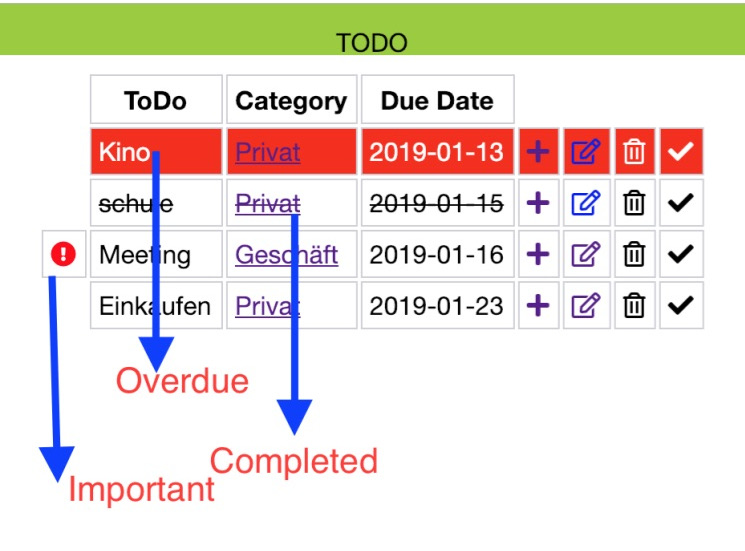
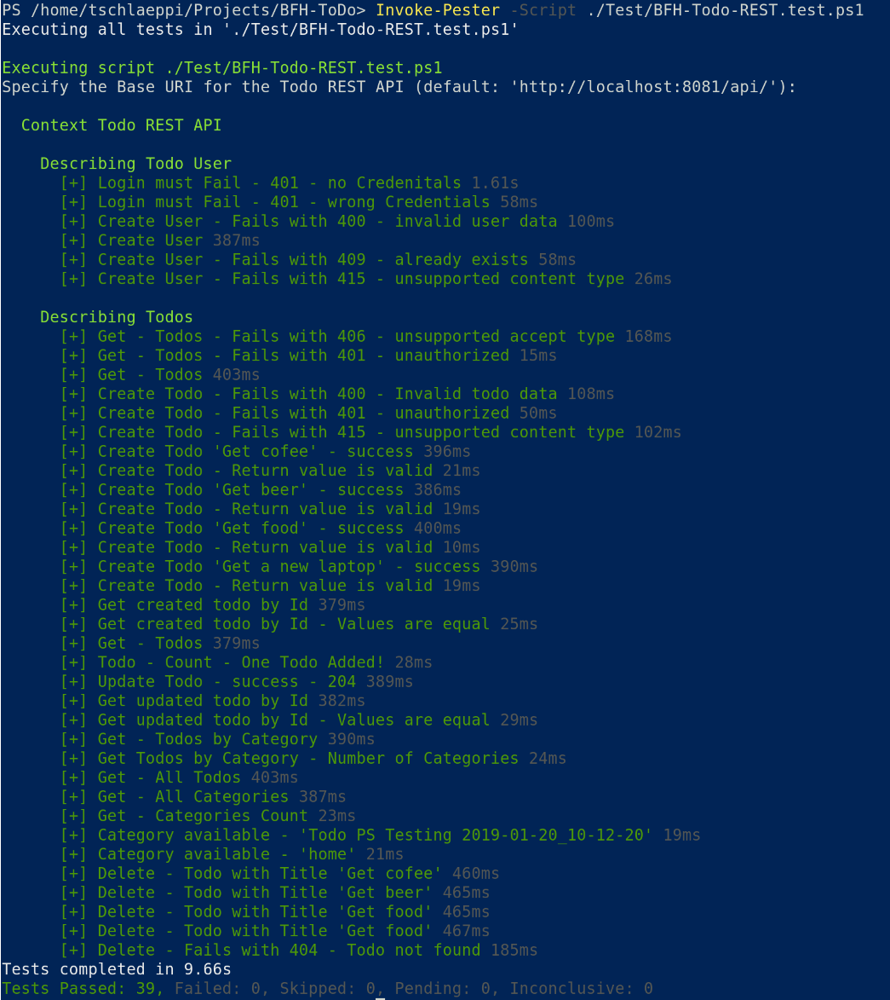

# BFH-ToDo
This is the Todo Application for Course Java and WebApp in CAS SD HS2018 at Berner Fachhochschule.

## Contributors
- Subramaniyam Indiraprakash
- Schläppi Thomas

## Mission!
### Functional Requirements
- Each user should be able to maintain a list of todos, i.e. create new todos, update todos, and delete todos.
- A todo consists of a title and may have a category and a due date. In addition, a todo may be marked as important or completed.
- Todos with a due date should be listed first and sorted by date, and overdue todos should be highlighted. In addition, it should be possible to display only the todos of a particular category.
### Non-functional Requirements
- The todos should be protected by a login such that no user can access the todos of another user.
- The todos should be persisted such that the todos are still available after a server restart.
- The graphical user interface should be easy to use and responsive.
### Architecture
The application consists of two parts:
- a classical web application which processes HTTP requests (using Java Servlets) and generates HTML responses (using JavaServer Pages)
- a RESTful web service which provides a programming interface that can be used to implement client side web application (using JavaScript)

[Complete mission description here](http://www.sws.bfh.ch/~fischli/courses/sd/webapps/todo/index.html), if not broken ;-)

## Solution
### Used technologies
The application is realized in Java, running on a tomcat server. At least Java 8 is required, tested on tomcat 9.x.

### Satisfying the Requirements
#### CRUD
Requirement: Each user should be able to maintain a list of todos, i.e. create new todos, update todos, and delete todos.
Solution: CRUD has been implemented in the TodoController, and in edit.jsp and add.jsp. Deletion has been realized via a small javascript snippet (webrequest).

#### Fields
Requirement: A todo consists of a title and may have a category and a due date. In addition, a todo may be marked as important or completed.
Solution: To prevent conversion faults, null-duedates are set to LocalDate.MAX. The GUI have to handle the LocalData.MAX values as not defined. Null-valued categories are emty strings. Note: category is a field on a todo - there is no category class that hosts the categories. There will be redundant data.

#### Sorting and Highlighting
Requirement: Todos with a due date should be listed first and sorted by date, and overdue todos should be highlighted. In addition, it should be possible to display only the todos of a particular category.
Solution: The sort algorythm is implemented in the TodoController servlet (simpler when only using HTML & CSS) - the highlighting is solved with CSS classes added from the jsp's logic.

#### Login
Requirement: The todos should be protected by a login such that no user can access the todos of another user.
Solution: The application has been secured for unauthorized access by implementing javax.servlet.Filter in Class LoginFilter. Unauthorized requests are dispatched to the /login route (LoginController). The TodoUser object is then registered in the Session (javax.servlet.http.HttpSession). The TodoDatasource interface only provides a method for getting the current TodoUser - not all.

#### Data persistence
Requirement: The todos should be persisted such that the todos are still available after a server restart.
Solution: The TodoUsers are persisted as XML. It is possible to select other datasources (ServletContext -> no persistence or Java object serialisation -> saved in a file). Further, the application is prepared to add more datasources such as MySql with little effort. More details at the end of the page.

#### GUI / Usability
Requirement: The graphical user interface should be easy to use and responsive.
Solution: For Add, Edit and Show Todos and the Login screen, the use of devices such as tablets and smartphones is possible.


#### JavaScript
- The Javascript functionality XMLHttpRequest is used While editing and deleting todos if the action was successful then the browser will redirect to home.

## Considerations
### Architecture
* The LoginFilter handles the filtering of pages that need to be protected with authentication.
* The Class TodoSession cares about tha TodoUser - handling between Datasource, Session and Request - this was chosen to minimize the getAttribute / setAttribute code lines which makes the access to the TodoUser simpler.
* Supported routes for accessing todos are "/add", "/delete", "/edit", "/get" - there is a "/home" route which dispatch the requests to "/get" - ther might be other functionality in the future, but at this time, home controller has no functionality.
* JSP pages are "/add.jsp", "/edit.jsp", "/home.jsp", "/login.jsp" and  "/error.jsp" (errorhandling). They are just views.

### Limitations 
* There are some Javascript parts - Browsers must have Javascript enabled.
* There is no validation of the XML written by the datasource - if there is something wrong, a human must resolve the problem, but the data should be written even if it is malformed.
* There is no functionality to administer TodoUsers (edit, delete)
* There is no functionality to log out (close jour browser).
* You should use HTTPS. Username and passwords are sent unencrypted over the network.

## REST!
The REST api was implemented on base of [this](http://www.sws.bfh.ch/~fischli/courses/sd/webapps/todo/apidoc/index.html) definition.
### Authentication
The authentication has been realized with HTTP basic authentication. To protect the API, a ServletFilter has been put in place.
### Test the REST
The testing of the REST interface was realized with Microsoft [Powershell](https://github.com/PowerShell/PowerShell) and [Pester](https://github.com/pester/Pester), which makes it easy to test the REST Interface. Since Powershell Core 6.x, it can be executed on Linux, MacOS and Windows.
To execute the tests, install Powershell and Pester, cd in your Project directory and execute the following code:
```powershell
Invoke-Pester -Script ./Test/BFH-Todo-REST.test.ps1
```
Result:


Note: there will be an error if the User already exists, since there is not deletetion for users - to avoid this error, simply delete the Todo User 'TodoTestUser' in the Datasource.

## Configuration (web.xml)
### Logging
For better analyzing errors, a logging was implemented.
At releasetime, only one Logger datasource has been registered, the logging with the ServletContext's [log method](https://docs.oracle.com/javaee/6/api/javax/servlet/ServletContext.html), but the application supports more logging datasources (classes that implement the LoggerDatasource interface, registration handled in LoggerRegistrar class).

The available severities are defined in ENUM TodoSeverity.
The specified LogLevel means, that only this type of errors and above will be logged (WARNING means WARNING and ERROR, ANY means ALL).

```xml
    <!-- Logger settings -->
    <context-param>
        <param-name>LoggerDatasourceType</param-name>
        <!-- Supported Values for LoggerDatasourceType: ServletContext -->
        <param-value>ServletContext</param-value>
    </context-param>
    <context-param>
        <param-name>LogLevel</param-name>
        <!-- Supported Values for LoggerDatasourceType: ERROR, WARNING, INFO, SUCCESS, DEBUG, ANY -->
    <param-value>ANY</param-value>
```
### Datasources
In the development process, we started first to save the TodoUsers in the ServletContext. While the application was getting more advanced, we played around with Java object serialisation and finally with XML marshalling. For every method of saving data, a Datasource object was created. You can extend datasources by creating a class that implements the TodoUserDatasource and adding the registration in class DatasourceRegistrar (e.g a MySQL datasource).

At releasetime, 'Xml' is the default.

```xml
    <!-- Datasources -->
    <context-param>
        <param-name>TodoDatasourceType</param-name>
        <!-- Supported Values for TodoDatasourceType: ServletContext, File, Xml -->
        <param-value>Xml</param-value>
    </context-param>
    <context-param>
        <param-name>TodoFileDatasource</param-name>
        <param-value>TodoFileDatasource.javaserialized</param-value>
    </context-param>
    <context-param>
        <param-name>TodoXmlDatasource</param-name>
        <param-value>TodoXmlDatasource.xml</param-value>
    </context-param>
```
